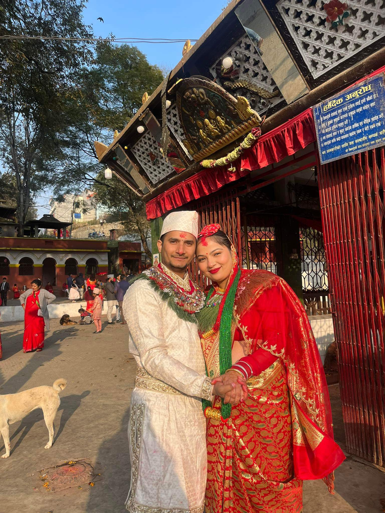
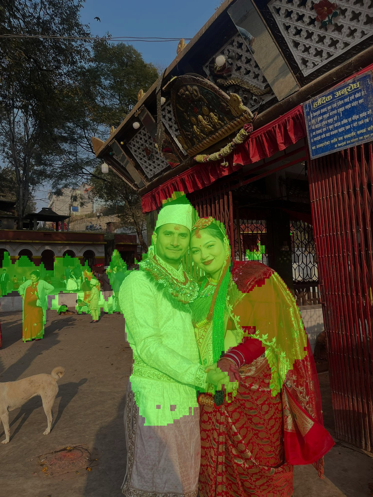

# UNet Implementation from Scratch

I have implemented UNet from scratch for image segmentation tasks. This repository contains all necessary files to run and train the UNet model.

## Directory Structure

```
Object_segmentation/
│── images/
│   ├── output.jpg
│   ├── test_image.JPG
│── model/
│   ├── __init__.py
│   ├── model.py
│── saved_model/
│   ├── unet_trained.pth
│── eval.py
│── UNET_paper.ipynb
│── requirements.txt
```

## How to Use

### Installation

Before running the model, install the required dependencies:

```bash
pip install -r requirements.txt
```

### Running the Model

To run the UNet model on an image:

```bash
python eval.py --image --path ./images/test_image.JPG
```

To check segmentation using a webcam, simply run:

```bash
python eval.py
```

This will process the input image or live video feed and generate the output.

## Model Checkpoints

The trained model weights are located in the `saved_model/` directory as `unet_trained.pth`. If you need this file, feel free to ask me. Alternatively, you can train your own UNet model using `UNET_paper.ipynb`.

## Output Example

- **Input:**  
  
- **Output:**  
  

## Reference

For more details on UNet, refer to the original paper: [U-Net: Convolutional Networks for Biomedical Image Segmentation](https://arxiv.org/abs/1505.04597)
