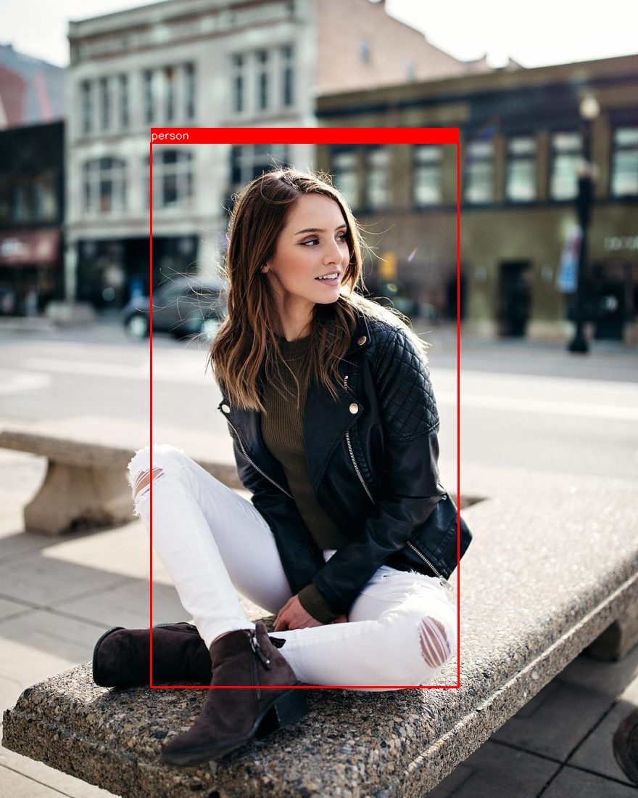
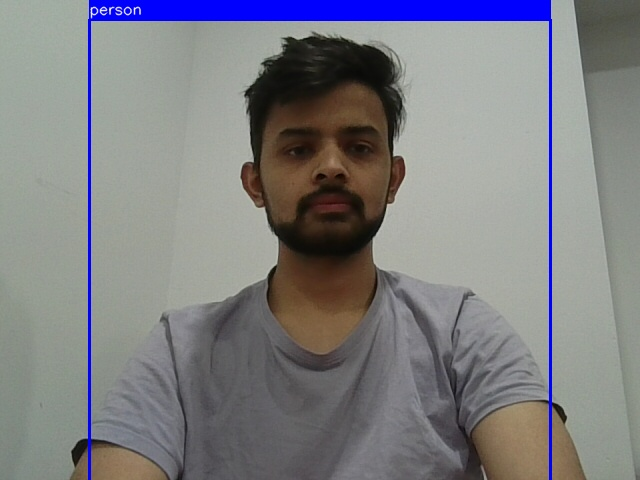

# YOLO Object Detection

This repository contains a YOLO-based object detection implementation for both webcam and image inputs using PyTorch and OpenCV. This implementation is developed from scratch, following the original YOLO paper.

If you are interested in reading the original YOLO paper, you can find it here: [YOLO Paper](https://arxiv.org/abs/1506.02640).

## 🚀 Features

- **Real-time Object Detection** using a webcam
- **Image-based Detection** on local images
- **Pretrained YOLO Model** loaded from a checkpoint
- **Automatic Preprocessing** with image normalization
- **Bounding Box Visualization**

---

## 📌 Prerequisites

Ensure you have Python installed (Python 3.7+ recommended). Install dependencies using:

```bash
pip install -r requirements.txt
```

---

## 📂 Project Structure

```
├── saved_model/        # Folder containing the YOLO model checkpoint
├── images/             # Folder for test images
├── utils/              # Utility functions (e.g., plotting, bounding box conversion)
├── model/              # YOLO model implementation
├── loss/               # Loss function implementation
├── YOLO.md             # Project documentation
├── requirements.txt    # List of dependencies
├── test_script.py      # Test script for model evaluation
├── train.py            # Train script for model training
└── main.py             # Entry point for running YOLO detection
```

---

## 🔧 Setup and Installation

### 1️⃣ Clone the Repository

```bash
git clone https://github.com/your-username/your-repository.git
cd your-repository
```

### 2️⃣ Install Dependencies

```bash
pip install -r requirements.txt
```

### 3️⃣ Download Pretrained Model

Place the YOLO model checkpoint file in `saved_model/`:

```bash
mkdir -p saved_model && mv /path/to/yolo_model.pth saved_model/
```

---

## 🎯 Usage

### Run YOLO Object Detection

#### 🖼️ Image Detection

To detect objects in an image:

```bash
python main.py --image --img_pth ./saved_image/test_image.jpg
```

**Input:**


**Output:**


#### 📷 Webcam Detection

To detect objects in real-time via webcam:

```bash
python main.py --webcam
```

**Example Output:** Real-time bounding box visualization with detected objects.

---



## 🛠 Testing the Implementation

Run the test script to validate model performance:

```bash
python test_script.py
```

This will test:

- Image transformations
- Model output correctness
- Bounding box predictions
